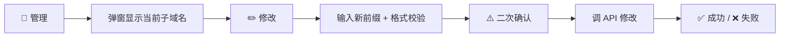

# 修改账号 Workers.dev 子域名功能 — 完成总结

## 变更内容

在"📂 管理账号"弹窗中新增了 **查看和修改账号级 workers.dev 子域名前缀** 的功能。

### 后端新增（2 个 API + 2 个处理函数）

| API 路由 | 方法 | 功能 |
|---|---|---|
| `/api/get_subdomain` | POST | 查询账号当前 workers.dev 子域名前缀 |
| `/api/change_subdomain` | POST | 修改账号 workers.dev 子域名前缀 |

- `handleGetSubdomain`: 调用 `GET /accounts/{id}/workers/subdomain` 查询
- `handleChangeSubdomain`: 调用 `PUT /accounts/{id}/workers/subdomain` 修改

### 前端变更

- **管理弹窗**：新增子域名显示栏 + ✏️修改按钮（indigo 配色）
- **`openAccountManage`**：并行加载 Workers 列表和子域名（`Promise.all`）
- **`promptChangeSubdomain`**：SweetAlert2 输入框 → 格式校验 → 二次确认 → 调 API → 成功刷新显示

### 交互流程

### 修改文件

render_diffs(file:///d:/DeskTop/GitHub/worker部署中控/worker.js)

## 验证

本项目为 Cloudflare Worker 单文件，无本地测试框架。需部署后手动验证：

1. 进入中控 → 账号列表 → 📂管理 → 确认子域名栏显示
2. 点击 ✏️修改 → 输入新子域名 → 确认 → 验证 API 返回
